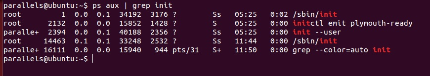

José Roberto Guerrero Zurita  
Diplomado Linux en Sistemas Embebidos  

#Linux Containers  

Los contenedores son una tecnología de virtualización ligera a nivel de sistema operativo de Linux que permite ejecutar instancias de sistemas operativos aislados conocidos como Servidores Privados Virtuales. Los recursos de los Servidores Privados Virtuales son compartidos con el servidor pero poseen su propio espacio de procesos y redes. Son similares a las tecnologias de virtualización como OpenVZ, Linux-VServer, FreeBSD jail o Solaris Containers. La base de funcionalidad son los cgroups y el aislamiento por espacio de nombres que se integraron al kernel de Linux en la versión 2.6.29.  

#Instalación LXC

Para instalar Linux Containers se corre el siguiente comando en la terminal:    
`sudo apt-get install lxc`

#Creación de contenedor

Para crear un contenedor primero se tiene que seleccionar de las plantillas que distribución se va a virtualizar.  

Para este caso utilicé la distribución de Ubuntu con el siguiente comando en la terminal:  

`sudo lxc-create -n ubu-veth-001 -t ubuntu`

Este comando crea el contenedor y se baja la distribución Trusty Ubuntu Minimal con todas sus dependencias. Se crea su propio sistema de archivos como se muestra acontinuación:  

#Ejecutar contenedor

Para ejecutar el contenedor se corre el siguiente comando en la terminal:

`sudo lxc-start -n ubu-veth-001`  
Para ver un listado de los contenedores en ejecución se corre el siguiente comando:  
`sudo lxc-ls --fancy`

Dentro del contenedor podemos observar como se crea su propio proceso init y los demás bprocesos del sistema como se muestra en la siguiente imagen:  

Dentro del servidor podemos reconocer que se encuentran dos procesos init. Uno con PID 1 y otro con PID 14463 perteneciente al contenedor.  

Las llamadas al sistema que hace el contenedor se hacen hacia las herramientas de lxc en espacio de usuario directamente al kernel de Linux del sistema servidor.  
